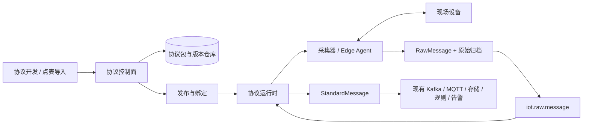

# 设备协议包与点表接入方案

> 实现状态（2026-09-03）：本方案的第一版已经落地为 `/api/v2` 协议子系统和新的“设备接入”页面。已实现不可变协议/点表版本、产品版本绑定与回滚 API、Modbus TCP FC01/02/03/04 主动轮询、CSV/XLSX 点表导入、标准消息解析、设备采集状态，以及带 Manifest 和样例测试的 ZIP 协议包上传。隔离的长驻 Worker、Edge Agent、签名/SBOM 扫描和生产网络白名单仍属于后续生产增强，不能据此视为生产验收完成。

## 1. 目标与结论

平台采用“协议运行时 + 版本化协议包 + 产品绑定 + 设备接入实例”的模式，借鉴 JetLinks 的动态协议思想，但不把所有接入都强制做成手写协议包。

提供两条用户路径：

1. **标准 Modbus TCP 快速接入**：上传 Excel/CSV 点表，选择内置 `modbus-tcp` 驱动，填写设备 IP、端口、Unit ID 和轮询周期，平台自动生成采集计划和解析映射，经预览确认后立即发布，无需写代码。
2. **自定义协议包接入**：开发者编写并构建协议包，上传版本化制品。平台完成校验、样本测试和安全检查后发布，运行时热加载，无需重启 API。

这里的“自动生效”定义为：**上传后可一键完成校验与发布，已发布版本由协议运行时动态加载；不允许一个新文件无版本、无校验地直接覆盖正在运行的生产版本。**

## 2. 必须拆开的三个概念

| 概念 | 负责什么 | 不负责什么 |
| --- | --- | --- |
| 接入驱动（Transport/Connector） | 建连、断线重连、主动轮询、请求应答、指令下发 | 业务字段含义 |
| 协议编解码（Codec） | 原始字节与标准消息之间的转换、校验、粘拆包 | 保存设备密码、决定轮询时间 |
| 点表/物模型（Point Model） | 地址、数据类型、比例、单位、读写和告警语义 | Socket 连接和进程生命周期 |

当前平台已有的 Parser Registry 主要解决“收到原始报文后怎么解析”。要实现“上传 Modbus TCP 点表后直接读取设备”，还必须增加主动采集驱动和调度器。

## 3. 总体架构



建议控制面仍在现有 Gin API 中；执行面独立为 `protocol-runtime`/`edge-agent`。被动 MQTT/HTTP 报文可继续进入现有 `IngestRaw`，Modbus TCP 等主动采集协议由采集器发起请求，再把响应封装成同一种 `RawMessage`，复用现有归档、Kafka、解析、告警和 AI 链路。

现场设备通常位于园区内网，因此采集器支持两种部署：

- 中心采集器：平台网络能直达设备时使用。
- 边缘采集器：部署在消防控制室或园区局域网，缓存采集结果并通过 MQTT/HTTPS 向中心上传；这是生产环境的推荐方式。

## 4. 路径一：上传点表，直接接入 Modbus TCP

### 4.1 用户操作

1. 进入“设备接入 > 点表快速接入”，上传 Excel/CSV。
2. 系统识别列并展示映射预览；无法确定的内容标红，禁止静默猜测。
3. 用户补充设备连接参数：IP/域名、端口（默认 502）、Unit ID、超时、重试和轮询周期。
4. 平台按功能码和连续地址自动合并采集块，展示将要发送的读请求。
5. 点击“连接测试”，完成 TCP 连通、读请求、响应校验和字段预览。
6. 点击“保存并启用”，自动创建或更新：点表版本、产品、产品协议绑定、设备接入实例和采集任务。
7. 首次采集成功后，在原始报文详情同时查看 Modbus 请求、响应和 `StandardMessage`。

### 4.2 标准点表模板

以下字段是最小可用契约；连接信息不放在点表中，避免同一产品的每台设备被迫使用相同 IP 和凭据。

| 字段 | 必填 | 示例 | 说明 |
| --- | ---: | --- | --- |
| `identifier` | 是 | `temperature` | 稳定英文标识，同一版本唯一 |
| `name` | 是 | 温度 | 中文显示名 |
| `functionCode` | 是 | `03` | 支持 01/02/03/04；写入后续支持 05/06/15/16 |
| `address` | 是 | `100` | 内部统一使用从 0 开始的 PDU 地址 |
| `addressNotation` | 是 | `zero_based` | 也可声明 `4xxxx`，导入时显式换算 |
| `dataType` | 是 | `int16` | bool、uint16、int16、uint32、int32、float32、float64、string、bits |
| `registerCount` | 否 | `1` | 可由数据类型推导，字符串需填写 |
| `byteOrder` | 否 | `big` | big/little |
| `wordOrder` | 否 | `ABCD` | 32/64 位数据必须明确 ABCD/CDAB/BADC/DCBA |
| `bit` | 否 | `3` | 从寄存器中取单个位 |
| `scale` / `offset` | 否 | `0.1 / 0` | 工程值 = 原始值 × scale + offset |
| `unit` | 否 | `℃` | 展示单位 |
| `access` | 否 | `read` | read/read_write |
| `pollIntervalSec` | 否 | `10` | 未填则继承产品默认值 |
| `deadband` | 否 | `0.5` | 降低无意义重复上报 |
| `qualityRule` | 否 | `0xFFFF=invalid` | 无效值/断线值定义 |
| `alarmMapping` | 否 | `1=FIRE` | 设备明确告警语义，可生成 `ALARM_REPORT` |

导入时必须检查：重复标识、地址越界、数据宽度重叠、不同轮询周期混组、功能码不兼容、字节序缺失、40001/0 地址歧义和超出设备单次最大读取长度。

### 4.3 采集计划

系统根据 `device + unitId + functionCode + pollInterval` 分组，将相邻地址合并为读块：

```text
点位 100、101、102、110
  -> 读取块 A: FC03 / start=100 / quantity=3
  -> 读取块 B: FC03 / start=110 / quantity=1
```

合并还要服从设备配置的 `maxRegistersPerRequest`、`maxGap` 和 Modbus 协议上限。轮询任务加入随机抖动，避免系统启动后所有设备同时请求。每台设备限制并发为 1，事务 ID 与请求上下文关联，异常码、超时和短响应进入采集诊断。

### 4.4 数据进入现有链路

每次响应先生成原始消息，再解析，不绕过审计链路：

```json
{
  "messageId": "raw_...",
  "tenantId": "tenant_001",
  "productId": "product_pump",
  "deviceId": "pump_01",
  "protocol": "modbus-tcp",
  "transport": "MODBUS_TCP",
  "payloadFormat": "hex",
  "payload": "000100000007010304...",
  "metadata": {
    "collectorId": "edge_01",
    "functionCode": 3,
    "startAddress": 100,
    "quantity": 3,
    "requestHex": "...",
    "latencyMs": 18
  }
}
```

内置 `modbus_tcp_codec` 根据当前点表版本生成 `PROPERTY_REPORT`、`ALARM_REPORT` 或通信质量事件。解析失败时只保留原始报文和失败原因，不对外发布伪造的标准数据。

## 5. 路径二：自定义协议包

### 5.1 协议包格式

协议包使用 ZIP 制品，而不是只上传一个裸二进制：

```text
vendor-fire-v2-1.2.0.zip
├─ manifest.yaml
├─ schema/
│  ├─ config.schema.json
│  └─ point.schema.json
├─ bin/
│  ├─ linux-amd64/protocol-worker
│  └─ linux-arm64/protocol-worker
├─ samples/
│  ├─ cases.json
│  └─ frames/
├─ sbom.spdx.json
└─ README.md
```

`manifest.yaml` 至少声明：

- `id`、`name`、语义化 `version`、厂商和说明。
- 支持的 transport、payload format 和运行时契约版本。
- 能力：`decode`、`encode`、`session`、`poll`、`command`。
- 入口文件、目标 OS/CPU、SHA-256 和资源上限。
- 所需配置项及敏感项引用；密码只引用 Secret ID，不写进制品或普通配置。
- 兼容的平台运行时版本和升级说明。

### 5.2 运行契约

第一阶段兼容当前 JSON Lines `RawMessage -> StandardMessage` 契约，但执行器改为可复用的长驻 Worker，避免当前每条报文创建一个进程的成本。建议逐步扩展为以下 RPC：

- `health`：运行时就绪检查。
- `validateConfig`：发布前验证配置。
- `decode`：原始报文转标准消息。
- `encode`：平台命令转设备报文。
- `splitFrame`：TCP 粘包/半包处理。
- `onConnect/onDisconnect`：可选会话生命周期。
- `pollPlan`：仅主动采集协议使用；普通 Codec 不授予网络权限。

复杂连接协议可以同时提供 Connector 能力；仅做报文转换的协议包只能访问输入输出，不能访问网络、文件、数据库和平台密钥。

### 5.3 上传、验证与发布

```text
上传制品
  -> 解压防护与 manifest/schema 校验
  -> SHA-256、签名、SBOM/恶意文件扫描
  -> 兼容性和权限检查
  -> 启动隔离 Worker
  -> 官方样例 + 用户样例契约测试
  -> DRAFT / VALIDATED
  -> 人工发布或“一键上传并发布”
  -> 小流量灰度
  -> PUBLISHED
```

上传失败不影响旧版本。灰度期间新旧版本同时可用，并比较成功率、解析耗时和字段差异；超过错误阈值自动停止灰度。产品绑定通过原子切换生效，回滚只需切回上一个版本。

## 6. 版本和数据模型

当前 `ProtocolPackage` 虽然有 `version` 字段，但持久化主键仍是 `tenant_id + id`，同一 ID 保存时会覆盖旧内容，不足以支撑生产回滚。建议拆成：

### 6.1 协议定义与不可变版本

- `protocol_definition`：`tenant_id + protocol_id`，保存名称、厂商和协议族。
- `protocol_release`：`tenant_id + protocol_id + version` 唯一；保存 manifest、artifact、digest、状态和兼容范围。进入 `PUBLISHED` 后内容不可修改，只能发布新版本。
- 状态：`DRAFT -> VALIDATING -> VALIDATED -> PUBLISHED -> DEPRECATED`；安全事件可进入 `REVOKED`。

### 6.2 绑定和实例

- `product_protocol_binding`：产品绑定协议及明确版本，保留上一版本、发布时间和发布人。
- `device_access_profile`：设备或网关实例的 host、port、unitId、超时、采集器、Secret 引用。
- `point_table_release`：不可变点表版本；保存规范化字段和源文件摘要。
- `collection_plan`：由点表编译出的读取块、周期和并发策略。
- `protocol_deployment`：某版本在某采集器的部署状态、健康、错误率和回滚信息。

产品绑定版本，设备只绑定产品和自己的连接参数。这样一份点表可被同型号的多台设备复用，而 IP、Unit ID 等设备级数据不会污染协议包。

## 7. 运行时热加载与一致性

1. 发布服务在数据库事务中写入 release 和 binding，并发送 `protocol.release.published` 事件。
2. 各协议运行时拉取制品，核对 SHA-256，启动新 Worker 并完成健康检查。
3. 运行时返回 READY 后，控制面把目标版本标记为 ACTIVE。
4. 新进入的消息使用新版本；已经开始的解析继续使用旧版本，避免同一报文处理一半时切换。
5. `RawMessage` 必须记录实际使用的 `protocolId`、`releaseVersion`、`pointTableVersion` 和 `collectorId`，保证以后可重放。
6. 旧 Worker 等在途请求结束后退出；至少保留最近两个已发布版本供快速回滚。

“已发布”表示控制面允许部署，“已激活”表示指定运行时已经加载成功。界面不能把两者混成一个状态。

## 8. 安全与稳定性边界

- 协议执行面与 API 进程分离；生产优先使用无特权容器或受控 Worker 池。
- Codec 默认无网络、只读文件系统、非 root、固定 CPU/内存/执行超时和输出上限。
- Connector 只允许访问设备配置声明的地址段；禁止任意互联网访问。
- 第一版通过 `IOT_MODBUS_ALLOWED_CIDRS` 限制主动 Modbus 目标网段；域名先解析为允许网段内的 IP，再使用该 IP 建连，避免借协议配置扫描任意网络或发生 DNS 重绑定。
- 制品不可覆盖，保存 SHA-256、上传人、发布时间、测试报告和审计记录；正式环境可要求签名。
- Secret 由平台密钥服务注入，日志、原始报文和协议包配置都不能包含明文密码。
- 单协议熔断，坏协议不能耗尽整个平台线程或内存；失败消息进入可查询的解析失败记录，并支持按原版本重放。
- 边缘采集器断网时本地限量缓存，恢复后按 messageId 幂等补传；超过容量按明确策略处理并告警。

## 9. 页面设计

建议将现有“协议开发”和“协议接入助手”收敛为以下入口：

### 9.1 协议中心

- 协议定义、版本、能力、状态、使用产品数、运行实例数。
- 上传协议包、样本测试、发布、灰度、停用和回滚。
- 查看 manifest、SHA-256、测试报告、运行指标和审计记录。

### 9.2 点表快速接入

- 下载标准模板、上传文件、列映射、错误行下载。
- 地址标准化预览和自动生成的采集块。
- 在线连接测试，展示请求 Hex、响应 Hex、字段值和质量码。
- “保存草稿”和“保存并启用”两个按钮；后者只在检查全部通过时可用。

### 9.3 设备接入实例

- 设备、产品、采集器、IP、端口、Unit ID、点表版本和连接状态。
- 最近轮询时间、耗时、连续失败、原始报文和解析结果入口。
- 单次立即采集、暂停/恢复和连接诊断。

## 10. 当前实现与剩余差距

| 能力 | 第一版已实现 | 后续生产增强 |
| --- | --- | --- |
| 运行时解析 | Parser Registry 按明确 release 版本解析，消息保存协议/点表版本 | 发布事件缓存刷新、版本级指标 |
| 自定义协议制品 | ZIP manifest、平台入口、摘要、样例实跑、发布后免重启解析 | 制品签名、SBOM、多架构构建流水线 |
| Modbus 点表 | CSV/XLSX、FC01/02/03/04、常用数据类型/字节序、采集块编译 | 厂商模板映射、在线点表设计器 |
| Modbus 主动采集 | 连接实例、轮询、超时、重试、重连、响应校验和连接测试 | 分布式调度、主备采集器、长稳压测 |
| 版本回滚 | 不可变 `protocol_id + version`、产品绑定和上一版本回滚 | 灰度比例、健康阈值和自动回滚 |
| 网络安全 | Modbus 目标 CIDR 白名单、DNS 解析后校验 | 项目/采集器级白名单和出站网络策略 |
| Worker 隔离 | 子进程、最小环境变量、超时、输出大小和身份保护 | 受限容器/Edge Agent、CPU/内存/网络配额、长驻 Worker 池 |

## 11. 建议实施顺序

### M1：闭环 Modbus TCP 点表直连（第一版已完成）

- 定义标准点表和导入错误报告。
- 实现 FC01/02/03/04、常用数据类型、字节序和比例换算。
- 实现 `device_access_profile`、采集块编译、Modbus TCP Client、调度和重连。
- 响应进入现有 RawMessage/StandardMessage 链路。
- 已用本地 TCP 模拟器完成自动化验证；至少一台真实设备验收仍待现场环境。

### M2：补齐真正的协议包版本管理（第一版已完成）

- 拆分 definition/release/binding，发布版本不可变。
- 已实现运行时按绑定版本加载、手工切换与上一版本回滚；发布事件、灰度和自动回滚后续补充。
- 旧协议包继续通过兼容 shim 使用；批量转换为 `1.0.0` release 后续按实际存量执行。

### M3：升级自定义协议运行时（ZIP 契约已完成，强隔离待做）

- 定义 ZIP manifest 和 SDK。
- 将单报文进程改为隔离的长驻 Worker 池。
- 补 encode、粘拆包、会话和指令应答能力。
- 完成签名、SBOM、网络权限、资源限制和故障隔离。

### M4：边缘采集与生产增强

- Edge Agent、离线缓存、远程配置和升级。
- 灰度发布、版本指标对比和自动回滚。
- 生产容量、TLS/ACL、Secret、灾备和长时间稳定性验收。

## 12. MVP 验收标准

### 点表路径

- 上传含 FC01/02/03/04 的标准点表后，能发现地址歧义和无效行。
- 不写代码即可创建产品、设备接入实例和采集计划。
- 对同一条真实响应能关联请求、原始归档、点表版本和标准消息。
- 断网、超时、Modbus 异常码、短响应和非法数据都有明确质量状态，不生成错误业务值。
- 修改点表生成新版本；旧原始报文仍可用旧版本重放。

### 自定义协议包路径

- 新协议包发布后无需重启 API 或采集器主进程即可加载。
- 错误制品、校验失败、Worker 崩溃和超时不影响旧版本及其他协议。
- 同一产品可灰度切换到新版本，并在失败时恢复旧版本。
- 每条标准消息都能追溯协议版本、制品摘要、原始报文和发布审计记录。

## 13. 推荐的产品原则

- 用户看到的是“两条路”：**简单设备上传点表，复杂设备上传协议包**。
- 点表不是一个简化版脚本，而是由平台内置、受测试的 Modbus 驱动解释的数据配置。
- 协议包负责扩展能力，点表负责声明数据；设备连接参数属于设备实例。
- 默认优先生成草稿并测试；“一键上传并发布”是快捷工作流，不取消内部安全闸门。
- 任何成功解析的数据继续复用项目现有 Kafka/MQTT/存储/规则/告警链路，避免再造第二套数据通道。

## 14. 第一版接口

| 接口 | 用途 |
| --- | --- |
| `GET /api/v2/protocols` | 查询协议定义和全部不可变版本 |
| `POST /api/v2/protocols` | 新建协议定义 |
| `POST /api/v2/protocols/{id}/releases` | 创建配置型草稿/已校验版本 |
| `POST /api/v2/protocols/{id}/package-releases` | 上传自定义 ZIP 协议包，默认校验后发布 |
| `POST /api/v2/protocols/{id}/releases/{version}/publish` | 发布已有版本 |
| `POST /api/v2/products/{id}/protocol-binding` | 切换产品协议版本 |
| `POST /api/v2/products/{id}/protocol-binding/rollback` | 切回上一版本 |
| `POST /api/v2/modbus-tcp/import` | 上传 CSV/XLSX 点表，可同时创建产品、设备和采集实例 |
| `GET/POST/PUT /api/v2/device-access-profiles` | 查询或维护设备接入实例 |
| `POST /api/v2/device-access-profiles/{id}/test` | 真实连接并读取第一个采集块，返回解析预览 |

自定义协议包使用 `go-json-lines-v1` Worker 契约。若选择上传后立即发布，ZIP 必须包含 `samples/cases.json`，平台会实际运行每个样例；任何 Worker 错误、超时、消息类型不一致或期望属性不一致都会阻止发布。

```json
[
  {
    "name": "正常属性上报",
    "input": {
      "protocol": "vendor-fire-v2",
      "transport": "TCP",
      "payloadFormat": "hex",
      "payload": "AA012A"
    },
    "expectedMessageType": "PROPERTY_REPORT",
    "expectedProperties": {"temperature": 42}
  }
]
```
